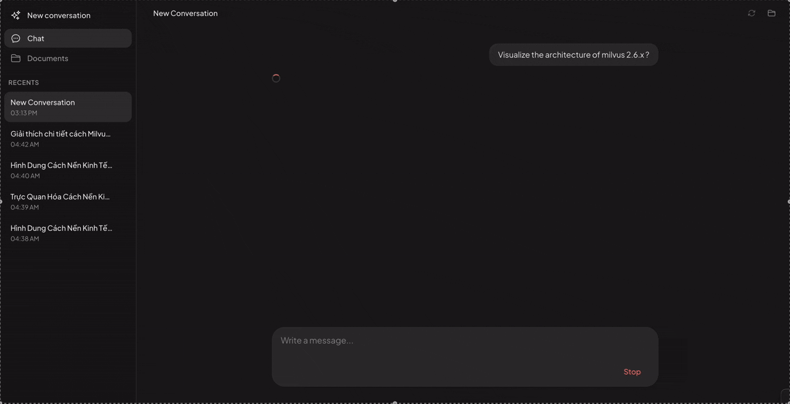
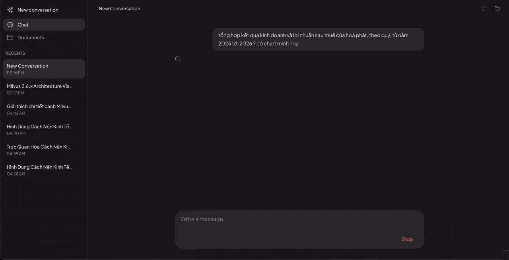

# AI Agent Inventory

An AI-powered agent inventory — modular components for building production-grade Agentic RAG applications.

[](https://github.com/phv2312/ai-agent-inventory/actions/workflows/precommit.yaml)
[](https://github.com/astral-sh/ruff)


---

## Demo

### Knowledge Base + Diagram



Ask questions over indexed documents — the agent retrieves relevant chunks, cites sources inline, and can render architecture diagrams directly in the chat panel.

### Document RAG + Inline Charts



Query structured data from uploaded PDFs (e.g. quarterly earnings reports). When a visual helps, the agent generates an interactive chart widget inline alongside cited answers.

---

## Getting started

### Prerequisites

- **Python 3.12+**
- **Node.js 20+** (for the React chat UI)
- **[uv](https://docs.astral.sh/uv/)** — Python package manager

### 1. Backend

```bash
# Install uv (skip if already installed)
pip install uv

# Create .venv and install dependencies (includes dev tools)
uv sync

# Activate the virtual environment
source .venv/bin/activate   # Windows: .venv\Scripts\activate
```

### 2. Environment variables

Copy the template and fill in your keys:

```bash
cp .env.example .env
```

Settings are read from the **process environment**, so load the file before
starting the API:

```bash
set -a && source .env && set +a   # macOS / Linux
```

Phoenix tracing is off by default, so local API runs do not need a Phoenix
server. Set `PHOENIX_TRACING_ENABLED=true` to export traces to an already
running Phoenix instance. Trace-backed evaluation also requires this setting.

Optional API settings (prefix `AGENT_API_`):

| Variable | Default | Description |
|:---------|:--------|:------------|
| `AGENT_API_DATA_DIR` | `.agent-api-data` | SQLite DB, Milvus Lite DB, uploaded PDFs, and rendered pages |
| `AGENT_API_DATABASE_URL` | *(SQLite in data dir)* | Override with a custom async SQLAlchemy URL |

### 3. Run the API

```bash
bash scripts/run.sh --api-only
```

- API: http://localhost:8080
- Interactive docs: http://localhost:8080/docs

See [agent/api/docs/integration-guide.md](agent/api/docs/integration-guide.md) for the full HTTP workflow (collections → PDF upload → chat).

### 4. Frontend (chat UI)

```bash
npm install --prefix frontend
```

Create `frontend/.env`. Leave `VITE_API_BASE_URL` empty to use the Vite dev
proxy (`/api` → `localhost:8080`), or set it explicitly:

```dotenv
VITE_API_BASE_URL=
```

```bash
bash scripts/run.sh
```

Open http://localhost:5173

### 5. Development checks (optional)

```bash
# Install git hooks (ruff, mypy)
pre-commit install

# Backend tests
pytest tests/ -q

# Frontend widget-runtime tests + production build
cd frontend && npm run test:widget-runtime && npm run build
```

### 6. Evaluation benchmark

The `evaluation/` package contains the 100-query agent benchmark, Phoenix trace
capture, metric evaluation, and visualization artifact extraction.

See [evaluation/README.md](evaluation/README.md) for commands. Latest run:
run-2 — 50 queries, 94% tool-call accuracy, 31/31 visualizations runnable.

### 7. Platform smoke test

The smoke test launches a fresh API data directory, uploads a real GraphRAG
PDF, waits for indexing, then checks web search, document retrieval, and the
visualization tool through the SSE API.

```bash
uv run python scripts/e2e_smoke.py
```

The committed fixture is `assets/fixtures/GraphRAG.pdf`. Pass `--pdf` or set
`E2E_PDF_PATH` to run the same checks against another PDF.

Add `--with-ui` to run the small Playwright journey as well: create a
collection in the UI, upload the same PDF, wait for indexing, select it for a
new conversation, and receive a grounded response. Install Chromium once
before the UI run:

```bash
cd frontend && npx playwright install chromium
```

The runner retains logs and SSE transcripts when it fails. Pass
`--keep-artifacts` to preserve them after a successful run too. It never uses
or deletes your normal `.agent-api-data` directory.

---

## Components

| Component | Description | Implementations |
|:----------|:------------|:----------------|
| agentic chat | OpenAI Agents SDK runtime for tool-driven RAG | - Azure OpenAI Responses |
| embeddings | Embedding model implementations for vector representations | - OpenAI embeddings |
| extractors | Utilities for extracting information from various sources | - PDF Extractor |
| models | Pydantic data models and schemas used throughout the system | - Message, Provider stream events |
| rag | Agentic RAG chat strategies with tool-driven retrieval | - AgenticChatStrategy (OpenAI Agents SDK) |
| programs | LLM programs that generate structured data using Pydantic models | - Base program framework |
| prompts | Templates and configurations for LLM chat prompts | - Agentic prompts |
| storages | Storage implementations including vector database integrations | - Local storage<br>- Milvus |
| textsplitters | Text chunking and splitting utilities for large documents | - Langchain text splitter |

---

## Roadmap

| Status | Feature |
|:------:|:--------|
| ✅ | Agentic-RAG implementation and React chat UI |
| ✅ | Built-in tools: internal search, web search, reflection |
| ✅ | Inline visual generation integrated into the chat demo |
| 🔲 | Agent skills — sandbox vs. local machine execution (decision pending) |
| 🔲 | Agent memory — define supported memory categories |
| 🔲 | Enhanced extractor — split documents into typed elements (table, section, figure) |
| 🔲 | Hybrid search support |
| 🔲 | Multimodal retrieval |
