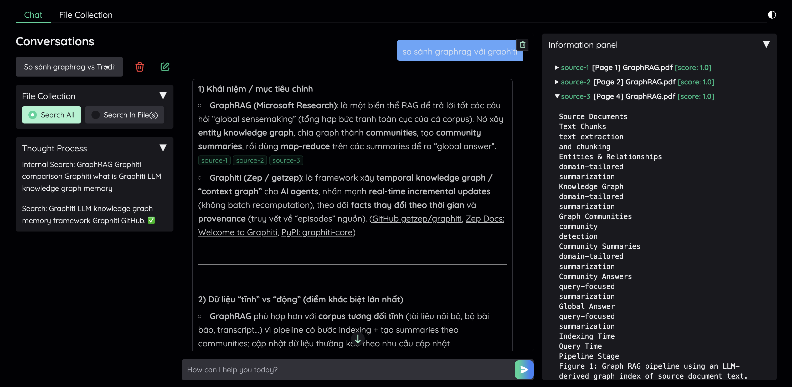
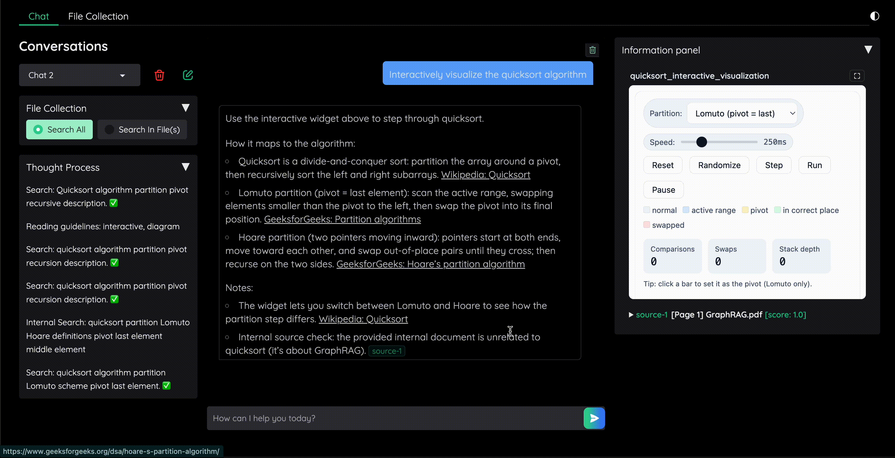

# AI Agent Inventory

An AI-powered agent inventory — modular components for building production-grade Agentic RAG applications.

[](https://github.com/phv2312/ai-agent-inventory/actions/workflows/precommit.yaml)
[](https://github.com/astral-sh/ruff)


---

## Demo

### Internal KB + Web Search



The agent automatically routes queries between the indexed knowledge base and live web search, citing exact source chunks inline.

### Inline Visuals



When the answer benefits from a chart or diagram, the agent generates an interactive widget rendered directly in the chat panel.

---

## Installation

```bash
pip install uv
uv sync
source ./venv/bin/activate
```

---

## Components

| Component | Description | Implementations |
|:----------|:------------|:----------------|
| chats | Chat model interfaces for interacting with LLM providers | - OpenAI chat<br>- Anthropic chat |
| embeddings | Embedding model implementations for vector representations | - OpenAI embeddings |
| extractors | Utilities for extracting information from various sources | - PDF Extractor |
| models | Pydantic data models and schemas used throughout the system | - Message, Provider stream events |
| rag | Agentic RAG chat strategies with tool-driven retrieval | - AgenticChatStrategy (ReAct + Responses API) |
| programs | LLM programs that generate structured data using Pydantic models | - Base program framework |
| prompts | Templates and configurations for LLM chat prompts | - Agentic prompts |
| searches | Search functionality including vector and semantic search | - Tavily search<br>- DuckDuckGo search |
| storages | Storage implementations including vector database integrations | - Local storage<br>- Milvus |
| textsplitters | Text chunking and splitting utilities for large documents | - Langchain text splitter |

---

## Roadmap

| Status | Feature |
|:------:|:--------|
| ✅ | Agentic-RAG implementation, demo with kotaemon-inspired theme |
| ✅ | Built-in tools: internal search, web search, reflection |
| ✅ | Inline visual generation integrated into the chat demo |
| 🔲 | Agent skills — sandbox vs. local machine execution (decision pending) |
| 🔲 | Agent memory — define supported memory categories |
| 🔲 | Enhanced extractor — split documents into typed elements (table, section, figure) |
| 🔲 | Hybrid search support |
| 🔲 | Multimodal retrieval |

---

## Stonitor (Market Observability)

Vietnamese equity observability demo under `applications/stonitor/`. Data via [vnstock](https://vnstocks.com/docs) v4+.

### Setup

```bash
uv sync

# Add to .env (see .env.example)
DATABASE_URL=postgresql://localhost/stonitor
VNSTOCK_API_KEY=your_key_from_vnstocks.com
OPENAI_API_KEY=...

cd applications/stonitor && uv run alembic upgrade head
uv run python -m applications.stonitor.app
```

Validation scenarios: `specs/002-market-observability/quickstart.md`.

**Attribution**: Market data powered by vnstock (HOSE/HNX/UPCOM).
